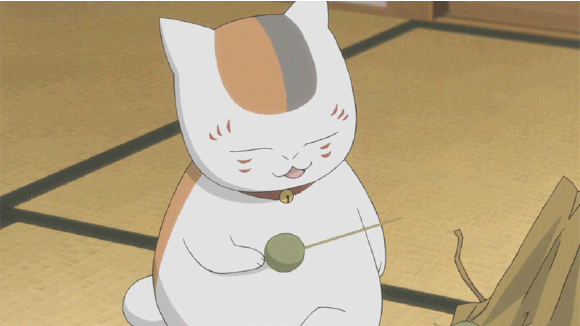

这是一个关于gif图片倒放的python脚本。相当于是一部电影，从结尾开始放映，一直放映到影片的开头，不一样的故事走向，也能给人不同的情感体验。

Imagine that you have a gif,and it seems quite normal.

However,you love abnormal things,and you want to see what will happen if you playback the gif.

Now we can do that by using python.

The result is as follows:

Please! Just show me your amazing looks~
